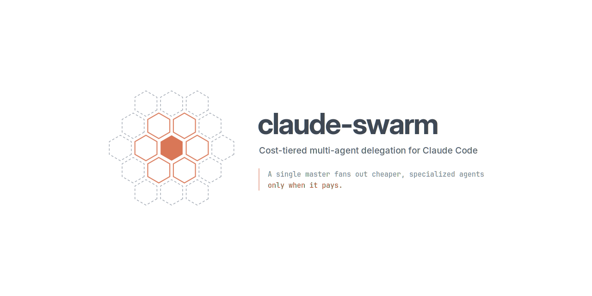

<picture>
  <source media="(prefers-color-scheme: dark)" srcset="img/header-dark.png">
  <source media="(prefers-color-scheme: light)" srcset="img/header-light.png">
  
</picture>

Your main context is the most expensive real estate in a Claude Code session: it is
re-sent on every turn, and everything that lands in it stays billed until the session
ends. claude-swarm keeps high-volume work out of it. Specialized subagents do the bulk
reading and the noisy runs in their own contexts and return summaries; each agent is
pinned to the cheapest model tier whose output something can grade; and for the one
workload that genuinely parallelizes — building an app from a finalized plan — a
workflow runs a wide wave of workers against a validated manifest.

Three moves, in the order they come up:

1. **Shield** — high-volume output stays out of the main context. Roughly cost-neutral
   on the turn it happens, then pays again on every turn that doesn't re-send it. Over
   a long session this is the difference between finishing with context to spare and
   hitting auto-compaction mid-task.
2. **Route** — one agent, cheapest viable tier. This is the cost lever: locating,
   deep reading, mechanical edits, and prose don't need the top tier.
3. **Build** — a wide wave of independent workers. Buys wall-clock time, never
   savings, and sits behind a gate that says exactly when it's worth it.

## What you get

**A tiered agent roster** — each agent pinned to the cheapest model that can do its
job well, with tool access cut to match:

| Agent | Model · effort | For |
|---|---|---|
| `claude-swarm:scout` | haiku | Where is it — paths and line numbers |
| `claude-swarm:tracer` | sonnet · xhigh | How does it work — reads a lot, returns a little |
| `claude-swarm:implementer` | opus · high | Production code where a mistake is expensive |
| `claude-swarm:mechanic` | sonnet · low | A decided change applied across N sites |
| `claude-swarm:verifier` | sonnet · xhigh | Adversarial: refute the claim, run the thing |
| `claude-swarm:scribe` | haiku | Docs, README, changelog, comments |
| `claude-swarm:leaf` | sonnet · low | Fills signature stubs inside the build workflow; turn-capped |

The pins are enforcement, not just pricing: `scout`, `tracer`, and `verifier` have no
write tools, `mechanic` is forbidden from redesigning what it applies, and `verifier`
is prompted to refute rather than confirm. Routing work to an agent constrains what
can happen to your repo, not only what it costs.

**Three workflows**, served by the plugin:

- **`claude-swarm:survey`** — map an area in one wave: a reader per angle, one
  synthesis. Pass the files if you already know them and readers skip discovery.
  Honest label: faster than reading solo and it keeps the sources out of your main
  window, but it is *not* cheaper — the angles share their input.
- **`claude-swarm:audit`** — find problems across lenses, then adversarially verify:
  findings are refuted by default, so only survivors are reported. Honest label: a
  quality play — independent refutation is something a solo pass structurally can't
  do — not a cost play.
- **`claude-swarm:build`** — the wide-wave case, for drafting an app from a finalized
  plan. See below.

**An orchestration skill** (`claude-swarm`) — the playbook the main loop loads when
deciding how to delegate: the three moves in order, the fan-out gate, the build
manifest schema.

**An always-on delegation policy**, injected each session by a SessionStart hook, so
the routing questions are in context without editing your `CLAUDE.md`.

**A completion feed** — a SubagentStop hook appends one line per finished subagent
(timestamp, agent type, final message) to `.claude-swarm-feed.log` in the project
directory. `tail -f` it during a wave: a status window at zero token cost. Add the
file to your project's `.gitignore`.

## Shield: keep volume out of the main context

The rule the policy injects: if answering needs more than ~3 files or ~500 lines, or
a command produces walls of output, send an agent and take back a summary. The
summary costs once; source pulled into the main window costs on every turn that
follows. A question answerable from context already loaded stays put — delegating it
buys nothing.

Read-only enforcement rides along for free: exploration routed to `scout` or `tracer`
cannot edit anything, because those agents have no write tools.

## Route: the cheapest tier that can do it

The rule, stated plainly: **a cheaper tier is safe when something other than a model
grades the output** — a compiler, a type checker, a test suite, a linter — and the
agent must run that grader itself before returning. That is what makes `mechanic` on
sonnet·low safe for mechanical sweeps: the compiler catches what slips. No grader —
design decisions, production code without tests, prose whose wrongness only a reader
notices — means the tier stays matched to the cost of a silent mistake, which is what
`implementer` on opus is for.

Routing heuristic: scout to find, tracer to understand, implementer to build what's
risky, mechanic to apply what's decided and graded, verifier to attack a claim,
scribe to write it up.

## Build: the wide wave, behind a gate

Fan-out is never the cheaper option at equal tier — N branches means N cold starts,
and cost only rises with N. What width buys is wall time. So the gate asks, in order:
are the branches' **reads and writes disjoint** (branches sharing input re-buy it per
branch; one context reading it once is always cheaper), is it **wide enough** that
the serial time removed beats the dispatch round added, and is it **shallow** —
every chained wave adds a linear penalty. The one workload that clears all three is
per-item work: one component per agent, one file per migration.

`claude-swarm:build` is built for exactly that shape — the initial draft of a web app
from a finalized plan:

1. **You (or the main loop) write the foundation**: schema, tokens, routing skeleton,
   shared utils, data layer — and, crucially, **signature files**: real files with
   exact names, props, and return types, and compiling placeholder bodies. Leaves
   fill blanks instead of interpreting prose, which is what keeps twelve parallel
   workers from drifting apart.
2. **The workflow validates a work manifest** — per unit: the paths it exclusively
   owns, the foundation paths it reads, what it builds — with plain code before
   anything spawns: no two units may own the same path, the dependency graph must be
   acyclic, no unit may own shared files (barrels, package manifests), every path
   must stay inside the project. A bad manifest fails loudly and spends nothing.
3. **A wide Sonnet leaf wave fills the bodies**, each leaf gated on exactly the
   foundation files its unit reads, each type-checking its own files before
   returning, each turn-capped so one wandering branch can't hold the wave open.
4. **Integration is split by grader**: a sonnet mechanic re-derives the truth from
   the tree (files present, filled, type-checked), writes the shared files, and fixes
   everything the compiler grades; only surfaced judgment calls escalate to opus.

The honest expectation: the ceiling is set by the serial fraction — the foundation
before the wave and the integration after it are sequential no matter how wide the
middle is — so **roughly 2x faster than a solo draft is the realistic target**, not
10x, at close to neutral cost because the leaf wave runs Sonnet instead of Opus. The
manifest schema and the dials (leaf concurrency, batching by shared read-set) are
documented in the skill.

## Install

```
/plugin marketplace add phil9922/claude-swarm
/plugin install claude-swarm
```

Or from a local clone:

```
/plugin marketplace add /path/to/claude-swarm
/plugin install claude-swarm
```

Start a new session after installing. The agents, skill, and workflows are served by
the plugin directly; the SessionStart hook injects the delegation policy.

**Requirement:** the hooks are small Node scripts, so `node` must be on your `PATH`.
If it isn't, the plugin still loads — you just won't get the injected policy or the
completion feed. To install it:

```
brew install node                  # macOS
sudo apt install nodejs            # Ubuntu/Debian
winget install OpenJS.NodeJS.LTS   # Windows
```

Or any other method from [nodejs.org](https://nodejs.org/en/download) — the hooks
have no version requirement beyond a non-ancient Node.

**Don't copy the roster into `~/.claude/agents/`.** Copies register under bare names
as a *second* roster alongside the plugin's namespaced one, and a policy naming one
set fails against the other with `Agent type not found`. The hook detects this and
names the offending files.

### Post-install: keep `Explore` cheap

**This is the one step the plugin cannot do for you, and skipping it quietly undoes
much of the saving.**

Claude Code ships a built-in `Explore` agent and reaches for it constantly — it is
usually the most-spawned agent in a session by a wide margin. Since Claude Code
v2.1.198 it **inherits the main conversation's model** (capped at Opus on the Claude
API). So on an Opus session, every ambient "go look that up" bills at Opus — exactly
the cost this plugin exists to avoid.

A subagent named `Explore` overrides the built-in and keeps its own `model` field.
But it **must be a user or project agent** — a plugin cannot supply one, because
plugin agents register under a namespaced identifier (`claude-swarm:explore`, not
`Explore`) and rank lowest in scope precedence. That is why this is a manual step
rather than another agent in `agents/`.

Create `~/.claude/agents/Explore.md`:

```markdown
---
name: Explore
description: Fast, read-only agent for searching and analyzing codebases.
model: haiku
tools: Read, Glob, Grep, Bash
---

Search and analyze the codebase. Return paths, line numbers, and short excerpts —
not full file dumps. Do not modify anything.
```

Restart the session afterwards. If you would rather not override it at all, set
`CLAUDE_CODE_DISABLE_EXPLORE_PLAN_AGENTS=1` to remove the built-in `Explore` and
`Plan` agents entirely — Claude then reads files directly instead of delegating to
them.

The SessionStart hook mentions this once per session while that file is absent, and
goes quiet as soon as it exists.

### Live swarm display

While a wave runs, the agent panel below the prompt shows one colored row per swarm
agent. The plugin ships this by default — plugin `settings.json` may carry the
[`subagentStatusLine`](https://code.claude.com/docs/en/statusline#subagent-status-lines)
key — so there is nothing to configure:

```
  LEAF    PriceBreakdown          1:24  ███░░░░░ 42%
  LEAF    SplitEditor             0:51  █░░░░░░░ 18%
  IMPL    integration             2:03  ██████░░ 71%
```

**Background color encodes the model tier, not the agent name.** In a build wave
every row is `claude-swarm:leaf`, so per-agent color would convey nothing; tier is
the thing this plugin routes on, and the wave reads as a cost heat map:

| Badge | Meaning |
|---|---|
| bright cyan | Haiku — cheap / cool |
| bright green | Sonnet — the workhorse |
| bright yellow | Opus — expensive / warm |
| **bright red** | **anomaly**: a `leaf` resolved to anything other than Sonnet — the void condition of the build prediction in `evals/README.md`. It should look *wrong*, not merely expensive. |

A task whose model isn't resolved yet gets a neutral (reverse-video) badge rather
than a guessed tier. Elapsed time uses weight, not color — dim when young, bold when
approaching the leaf turn cap — so it never fights the tier badge. When the panel is
narrow the context bar drops first, then the label, then elapsed; the badge never
drops. Rows for agents that aren't ours are left on Claude Code's default rendering.

Per-row `model` and `contextWindowSize` need Claude Code **v2.1.205+**; on older
versions the rows degrade to badge + label + elapsed. The same gates as the rest of
the plugin apply: the workspace trust dialog must be accepted, and `disableAllHooks`
disables status lines too.

### Post-install: aggregate count on the main status line

A compact `swarm 2H 5S 1O` segment — running swarm agents by tier, same colors, red
only for anomalies — can sit in your main status line. This one is a manual step for
two documented reasons:

- A plugin's `settings.json` cannot ship `statusLine` — "Only the `agent` and
  `subagentStatusLine` keys are currently supported" (plugins reference).
- The main status line's stdin carries **session data only, no task list** — the
  `tasks` array goes exclusively to `subagentStatusLine`. So the subagent renderer
  caches a ~100-byte per-session aggregate in the OS temp dir (the statusline docs'
  own caching pattern, keyed by `session_id`), and this segment reads it with a
  10-second staleness cutoff. Display-only; safe to delete at any time.

Copy `scripts/swarm-statusline.js` to somewhere stable — a settings entry cannot use
`${CLAUDE_PLUGIN_ROOT}`, and the plugin's install path changes on every update, so
point at your own copy rather than into the plugin directory:

```
cp /path/to/claude-swarm/scripts/swarm-statusline.js ~/.claude/
```

(Any clone of this repo works as the source; so does the installed plugin directory —
ask Claude for its path — as long as you *copy* out of it.)

Then add to `~/.claude/settings.json` (or compose it into an existing status line
script by appending its output — it prints one segment, no newline, and prints
nothing while no swarm agents run):

```json
{
  "statusLine": {
    "type": "command",
    "command": "node ~/.claude/swarm-statusline.js",
    "refreshInterval": 1
  }
}
```

`refreshInterval: 1` matters: the event-driven status line triggers go quiet exactly
when this display matters most — "The event-driven triggers can go quiet when the
main session is idle, for example while a coordinator waits on background subagents"
(statusline docs). The status line runs locally and consumes no API tokens.

## Cost model

- **Master** = the main loop / a Workflow script on **Opus** — or **Fable** if you've
  opted your session into it.
- **Swarm** = haiku and sonnet agents, picked per task.
- **The routing depends on one thing: the ordering `haiku < sonnet < opus < fable`.**
  That holds on every plan and every provider, which is why it's what the rules are
  written against.
- **Fable is opt-in only.** It sits above Opus at the top of that ladder and is never
  routed to automatically — it's proposed only for a task Opus has actually failed
  at, with the cost named.

Deliberately absent: per-token dollar figures. On a subscription plan there is no
per-token price to reason about, and on API billing the published rates move — a
number baked into this README would be wrong for some readers and stale for the
rest. See [Anthropic's pricing](https://www.anthropic.com/pricing) for current
rates; nothing in this plugin's routing needs them.

Two consumption notes worth knowing:

- Since Claude Code v2.1.198 subagents **inherit the main conversation's extended
  thinking configuration**, and there is no per-subagent thinking setting. Turning
  thinking down in the main session turns it down for the whole swarm; the per-agent
  `effort` pins still apply on top.
- The benchmark suite in `evals/` measures the plugin's claims against a solo-Opus
  control — with the plugin, without it, and with delegation denied — and its
  predictions are written down *before* the runs. The claims above are labeled the
  way they are because of it.

## Layout

```
claude-swarm/
  .claude-plugin/
    plugin.json          # plugin manifest
    marketplace.json     # single-repo marketplace (this repo is both)
  agents/                # the tiered roster, incl. the build leaf
  skills/claude-swarm/   # the orchestration playbook
  workflows/             # survey.js, audit.js, build.js (auto-discovered)
  hooks/                 # SessionStart: inject the policy; SubagentStop: completion feed
  settings.json          # ships the subagentStatusLine renderer by default
  scripts/               # status line renderers: per-agent rows + main-line segment
  evals/                 # three-arm benchmark harness and recorded predictions
  test/smoke.js          # manifests, hooks, workflows, validator (npm test)
  .github/workflows/     # CI: runs the smoke test on push/PR
  img/                   # README header banner (light/dark)
```

## Support

claude-swarm is free and open source, built and maintained by one person. If it
saved you some tokens, you can [buy me a coffee](https://ko-fi.com/phil9922). ☕

## License

MIT — see [LICENSE](./LICENSE).
